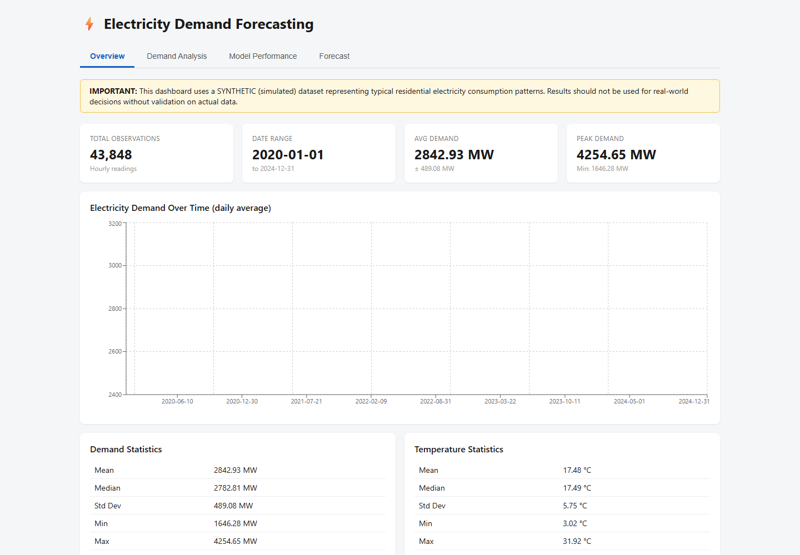
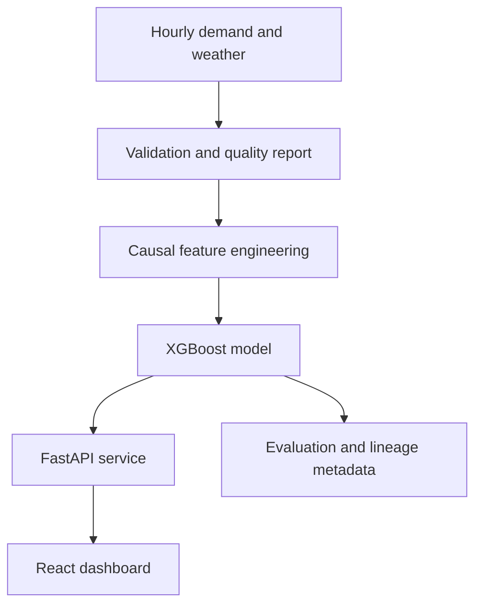
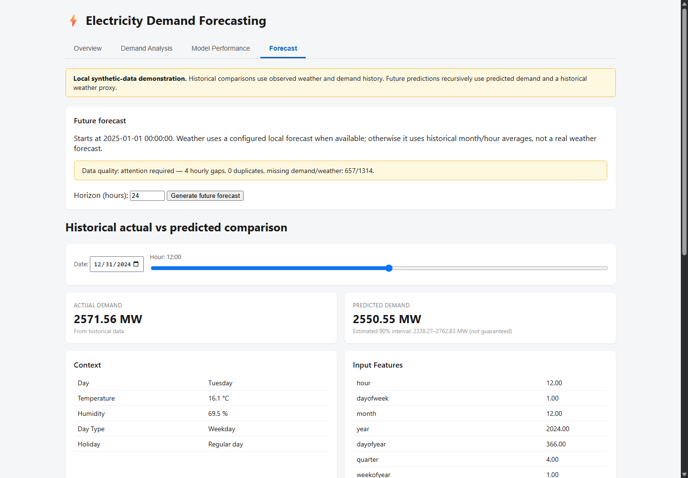
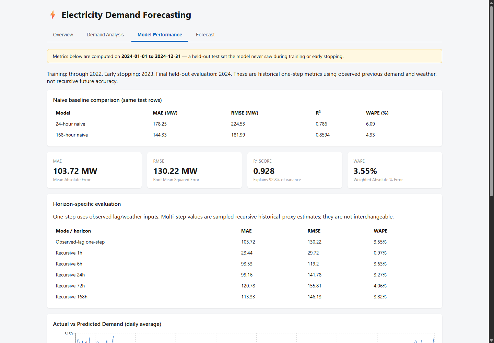

<div align="center">

# Electricity Demand Forecasting

### Leakage-safe forecasting with an explainable React + FastAPI dashboard

[](https://github.com/deleted04user/electricity-demand-forecasting/actions/workflows/quality.yml)


An end-to-end portfolio project for hourly demand analysis, causal feature engineering, model evaluation, historical comparison, and experimental 1–168 hour forecasting.

> This repository uses **synthetic demonstration data**. Its results are not operational forecasts and must not be used for grid or commercial decisions without validation on verified real data.

</div>



## Why this project stands out

- Uses chronological splits and expanding rolling-origin validation instead of random time-series splits
- Builds demand features strictly from past observations to prevent target leakage
- Compares XGBoost against 24-hour and 168-hour naive baselines
- Records model lineage, feature order, checksums, evaluation periods, and promotion evidence
- Exposes analysis and forecasts through a documented FastAPI service
- Provides both a modern React dashboard and an optional Streamlit interface
- Includes backend API/model tests and frontend component, lint, and production-build checks

## Verified model performance

The active model was evaluated once on 8,666 usable rows from the untouched 2024 holdout.

| Model | MAE (MW) | RMSE (MW) | R² | WAPE | Bias (MW) |
| --- | ---: | ---: | ---: | ---: | ---: |
| 24-hour naive | 178.25 | 224.53 | 0.7860 | 6.09% | -0.99 |
| 168-hour naive | 144.33 | 181.99 | 0.8594 | 4.93% | -1.15 |
| Previous XGBoost | 112.95 | 141.32 | 0.9152 | 3.86% | -59.99 |
| **Active XGBoost** | **103.72** | **130.22** | **0.9280** | **3.55%** | **-28.58** |

Bias is `mean(prediction - actual)`; a negative value indicates underforecasting.

## System architecture



## Product views

| Forecast | Model performance |
| --- | --- |
|  |  |

## Methodology

### Causal features

`backend/features.py` is shared by training and serving.

- Demand lags: 1, 2, 3, 6, 12, 24, 48, 72, 168, and 336 hours
- Rolling mean and standard deviation: 6, 24, and 168 hours, after shifting demand by one hour
- Calendar signals: hour, weekday, month, year, day-of-year, quarter, ISO week, weekend, and Moroccan public holidays
- Cyclical encodings: hour and weekday sine/cosine components
- Weather: temperature, humidity, and temperature squared

Weather is forward-filled only. Demand targets are never imputed for evaluation.

### Evaluation design

`backend/modeling.py` defines chronological boundaries, three expanding 2023 validation folds, a bounded eight-configuration search, naive baselines, and guarded artifact promotion. Candidate selection uses mean validation WAPE with RMSE as the tie-breaker. The untouched 2024 period is scored only after selection.

### Forecast scope

Historical metrics represent one-step-ahead/short-horizon performance with observed prior demand and weather. The future endpoint is experimental: later lag features consume earlier predictions, so uncertainty can grow with horizon. Without verified future weather, the system uses a labeled historical month/hour proxy—not a weather forecast.

## Quick start

### Requirements

- Python 3.12+
- Node.js 22+
- npm

### Backend

```bash
git clone https://github.com/deleted04user/electricity-demand-forecasting.git
cd electricity-demand-forecasting
python -m venv .venv
source .venv/bin/activate
python -m pip install -r requirements-api.txt
python -m uvicorn backend.main:app --reload --port 8000
```

On Windows PowerShell, activate with `.\\.venv\\Scripts\\Activate.ps1`.

API documentation: `http://localhost:8000/docs`

### Frontend

```bash
cd frontend
cp .env.example .env
npm ci
npm run dev
```

Dashboard: `http://localhost:5173`

For complete Windows instructions, see [RUNNING_THE_REACT_DASHBOARD.md](RUNNING_THE_REACT_DASHBOARD.md).

## API surface

| Endpoint | Purpose |
| --- | --- |
| `GET /api/health` | Service, artifact, and data-quality status |
| `GET /api/meta` | Date range, configuration, and compatibility metadata |
| `GET /api/overview` | Summary statistics and daily demand series |
| `GET /api/demand-analysis` | Hourly/monthly patterns and correlations |
| `GET /api/model-performance` | Metrics, baselines, feature importance, and diagnostics |
| `GET /api/forecast` | Historical actual-versus-predicted comparison |
| `POST /api/forecast/future` | Experimental recursive future forecast |

## Operational data contract

Set `ELECTRICITY_DATA_PATH` to a local `.csv`, `.xlsx`, or `.xls` containing:

| Column | Contract |
| --- | --- |
| `Timestamp` | Unique, sortable, unambiguous hourly timestamps |
| `Demand` | Numeric demand target |
| `Temperature` | Numeric temperature |
| `Humidity` | Numeric percentage |

Optional configuration:

- `WEATHER_FORECAST_PATH`: local file with `Timestamp`, `Temperature`, and `Humidity` for each future hour
- `VERIFIED_EVENTS_PATH`: local file with `Date` and `Event`
- `CORS_ORIGINS`: comma-separated browser origins

The API reports gaps, duplicates, missing values, outliers, coverage, and model/data compatibility. It does not silently repair source data.

## Safe retraining

```bash
python -m backend.modeling --train --data /path/to/verified_hourly.csv
python -m backend.evaluate --manifest
```

Training refuses the bundled synthetic workbook, preserves candidates, and promotes a model only when it improves WAPE or RMSE on common holdout rows. Keep an unchanged final holdout period when supplying real data.

## Verification

```bash
python -m pip install -r requirements-dev.txt
python -m pytest backend/tests -q

cd frontend
npm ci
npm run check
```

Current verified result: **21 backend tests and 8 frontend tests pass**, with frontend lint and production build also passing.

## Repository structure

```text
backend/      FastAPI endpoints, ingestion, features, modeling, and tests
frontend/     React/Vite dashboard and component tests
data/         Bundled synthetic workbook
models/       Active artifact, candidates, archive, and lineage metadata
figures/      Portfolio and report screenshots
scripts/      Report-capture automation
dashboard.py  Optional legacy Streamlit dashboard
```

## Limitations and responsible use

- Synthetic data cannot establish real-world forecasting performance.
- Recursive forecasts accumulate error and rely on supplied weather or a historical proxy.
- Empirical 90% intervals are estimates, not guarantees.
- The bundled model must be retrained and validated before operational use.
- Third-party report and data assets retain their respective rights; the MIT license applies to original project software.

## License

Original project software is released under the [MIT License](LICENSE).
