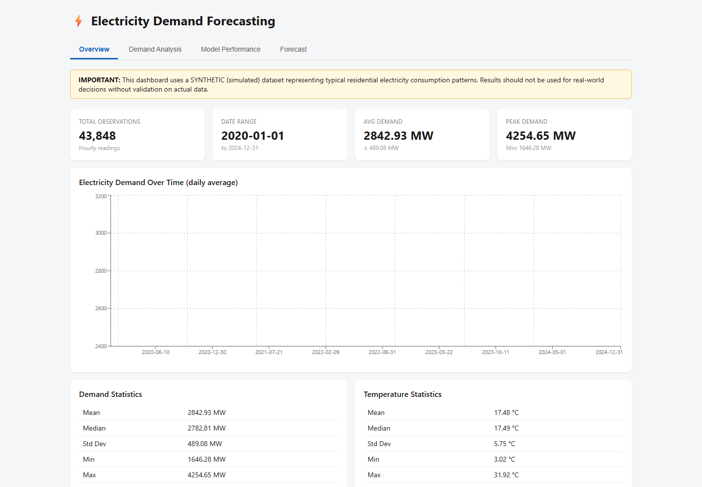
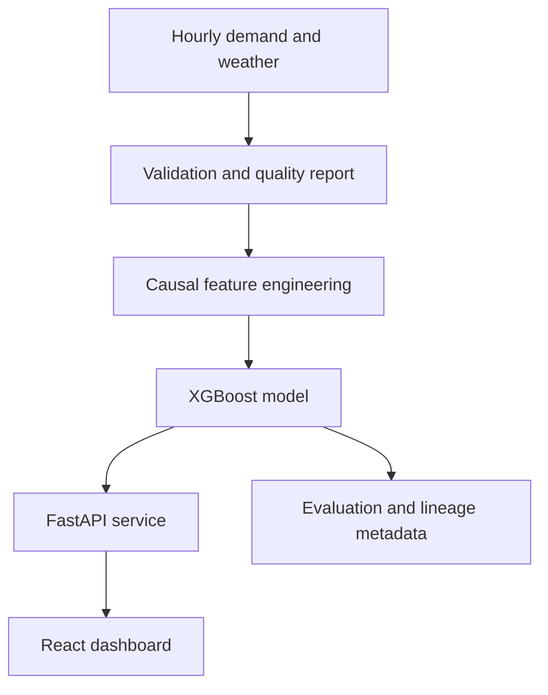

# Electricity Demand Forecasting

[](https://github.com/deleted04user/electricity-demand-forecasting/actions/workflows/quality.yml)

Hourly demand analysis and XGBoost forecasting, served by FastAPI with a React dashboard. The repository includes causal feature engineering, chronological evaluation, naive baselines, data-quality reporting, and an experimental 1–168 hour recursive forecast.

**The bundled workbook is synthetic demonstration data.** Its metrics demonstrate the implementation; they do not establish forecasting accuracy for a real electricity system. Retrain and validate on verified real data before operational or commercial forecasting use.



## Run with Docker

Install Docker with Compose, start its engine, and run from the repository root:

```bash
docker compose up --build
```

Open the dashboard at [localhost:8080](http://localhost:8080), the API documentation at [localhost:8000/docs](http://localhost:8000/docs), or the health endpoint at [localhost:8000/api/health](http://localhost:8000/api/health). The frontend forwards `/api` requests to the backend. No credentials or external data services are required for the bundled demo.

Stop with `docker compose down`. `API_PORT` and `FRONTEND_PORT` optionally override the default published ports. See [the local running guide](RUNNING_THE_REACT_DASHBOARD.md) for configuration and troubleshooting.

## Run from source

Use **Python 3.12** and **Node.js 24.15+ (24.x LTS)** with npm. Runtime and development Python dependencies have separate lock files; `requirements.lock.txt` adds optional notebooks and the legacy Streamlit dashboard.

```bash
git clone https://github.com/deleted04user/electricity-demand-forecasting.git
cd electricity-demand-forecasting
python -m venv .venv
source .venv/bin/activate
python -m pip install --require-hashes -r requirements-api.lock.txt
cp .env.example .env
python -m uvicorn backend.main:app --env-file .env --reload --port 8000
```

On Windows PowerShell, activate with `.\.venv\Scripts\Activate.ps1` and copy the environment example with `Copy-Item .env.example .env`. [The running guide](RUNNING_THE_REACT_DASHBOARD.md) includes complete PowerShell commands without requiring activation.

In a second terminal:

```bash
cd frontend
npm ci
npm run dev
```

Open [localhost:5173](http://localhost:5173). Vite proxies `/api` to the backend at `127.0.0.1:8000`; an optional `VITE_API_BASE_URL` overrides that behavior. See [frontend/README.md](frontend/README.md).

## Verify a checkout

Standard project metadata in [pyproject.toml](pyproject.toml) declares runtime and optional development, research and legacy dependencies for package tools. The hashed requirements locks remain the reproducible setup path. See [docs/PACKAGING.md](docs/PACKAGING.md) for dependency consistency and package-resource scope.

From the root, with the Python environment active:

```bash
python -m pip install --require-hashes -r requirements-dev.lock.txt
python -m ruff check backend
python -m ruff format --check backend
python -m mypy backend
python -m pytest --cov=backend --cov-fail-under=90 --cov-report=term-missing
python -m pip_audit --strict --disable-pip -r requirements-api.lock.txt
```

Then run `npm ci` and `npm run check` from `frontend/` for lint, component tests, and a production build. CI enforces at least 90% branch-aware backend coverage on Linux and Windows, checks types and dependencies, and exercises the dashboard in Chromium against the Docker API. Coverage requirements are defined in [pyproject.toml](pyproject.toml); results and machine-readable evidence are available in the [Quality workflow](https://github.com/deleted04user/electricity-demand-forecasting/actions/workflows/quality.yml). See [CONTRIBUTING.md](CONTRIBUTING.md) and [QUALITY_EVIDENCE.md](QUALITY_EVIDENCE.md).

## Architecture and methodology


```mermaid
flowchart TD
    A[Hourly demand and weather] --> B[Validation and quality report]
    B --> C[Causal feature engineering]
    C --> D[XGBoost model]
    D --> E[FastAPI service]
    E --> F[React dashboard]
    D --> G[Evaluation and lineage metadata]
```

The application factory in [backend/main.py](backend/main.py) loads an independent [forecast service](backend/service.py) during lifespan startup. Imports do not read the model or workbook. Frozen [settings](backend/settings.py) capture configuration, while a trusted [artifact manifest](models/artifact-manifest.json) checks the model checksum, feature order, and XGBoost runtime before deserialization. Evaluation uses the service directly without importing the API.

Versioned [diagnostics](models/diagnostics.json) are matched to code, data, model, events, and timezone. The service warms them during startup; dashboard requests read prepared results. A changed identity cannot reuse the prior snapshot. Review and commit the model and its trusted manifest together when promoting an artifact.

[backend/features.py](backend/features.py) is shared by training and serving. It builds demand lags from 1 to 336 hours, rolling mean and standard deviation after shifting demand by one hour, calendar and Moroccan public-holiday signals, cyclical time encodings, and weather features. Weather is forward-filled only; missing demand targets are excluded from evaluation.

[backend/modeling.py](backend/modeling.py) uses chronological boundaries, three expanding 2023 validation folds, and a bounded eight-configuration search. Candidate selection minimizes mean validation WAPE, with RMSE as the tie-breaker. The selected configuration is then evaluated on common usable 2024 rows against the active model and 24-hour/168-hour naive baselines. Candidates and promotion reports retain evaluation evidence.

### Bundled model evaluation

These values are recorded in [models/metadata.json](models/metadata.json), using 8,666 usable rows in the synthetic 2024 holdout. Historical metrics use observed prior demand and weather.

| Model | MAE (MW) | RMSE (MW) | R² | WAPE | Bias (MW) |
| --- | ---: | ---: | ---: | ---: | ---: |
| 24-hour naive | 178.25 | 224.53 | 0.7860 | 6.09% | -0.99 |
| 168-hour naive | 144.33 | 181.99 | 0.8594 | 4.93% | -1.15 |
| Active XGBoost | 103.72 | 130.22 | 0.9280 | 3.55% | -28.58 |

Bias is `mean(prediction - actual)`. The future endpoint feeds earlier predictions into later lag features, so its error can grow with horizon. Without supplied future weather, it explicitly labels its historical month/hour proxy. Empirical 90% prediction intervals are estimates, not guarantees.

## API

Interactive request and response schemas are available at `/docs` and `/openapi.json`.

| Endpoint | Purpose |
| --- | --- |
| `GET /api/live` | Process liveness, independent of model readiness |
| `GET /api/health` | Service, model, and data-quality status |
| `GET /api/meta` | Historical date range, next forecast start, and configuration |
| `GET /api/overview` | Summary statistics and daily demand series |
| `GET /api/demand-analysis` | Hourly/monthly patterns and correlations |
| `GET /api/model-performance` | Metrics, baselines, feature importance, and diagnostics |
| `GET /api/forecast?date=2024-12-31&hour=12` | Historical actual-versus-predicted comparison |
| `POST /api/forecast/future` | Experimental recursive future forecast |

For future forecasts, use `future_start` from `/api/meta` as the timezone-naive `start`, and an integer `horizon` from 1 to 168. Optional `temperature` and `humidity` arrays must both contain exactly `horizon` finite numbers; humidity must be within 0–100. Explicit arrays take precedence over a configured weather file. See [the running guide](RUNNING_THE_REACT_DASHBOARD.md) for an executable request.

Weather values must be JSON numbers; booleans and numeric strings are rejected,
and each array is capped at 168 items. HTTP bodies have a 64 KiB default limit,
enforced on actual streamed bytes as well as declared length; oversized requests
return HTTP 413. Normal forecasting payloads fit within that limit. The dashboard
aborts requests after 30 seconds, including stalled response bodies, and permits
retry instead of leaving forecasting disabled indefinitely.

If initialization fails, readiness and data/forecast endpoints return HTTP 503 with a controlled error response; `/api/live` remains available for diagnosis. Fix configuration and restart the service. Response schemas reject non-finite model outputs; legitimately undefined statistics are represented as null or omitted observations.

Responses include an `X-Request-ID` for correlating requests with structured JSON logs on stderr. Request logs record method, path, status, and duration; they omit query strings and request bodies. Unexpected failures log server-side error details for diagnosis.

Optional [error reporting](docs/OBSERVABILITY.md) can aggregate unexpected failures
without sending request contents. Review the [security policy](SECURITY.md) and
[threat model](docs/THREAT_MODEL.md) before changing the local deployment boundary.

## Local data configuration

Copy [.env.example](.env.example) to `.env` and pass `--env-file .env` to Uvicorn. Environment values are read when the backend starts; restart it after changes.

| Variable | Purpose / default |
| --- | --- |
| `ELECTRICITY_DATA_PATH` | Local demand CSV/XLSX; defaults to the bundled workbook |
| `ELECTRICITY_TIMEZONE` | Local clock timezone for aware demand timestamps; `Africa/Casablanca` |
| `WEATHER_FORECAST_PATH` | Optional local future-weather CSV/XLSX |
| `VERIFIED_EVENTS_PATH` | Optional local CSV/XLSX containing `Date` and `Event` |
| `CORS_ORIGINS` | Comma-separated allowed browser origins; local Vite origins by default |
| `MAX_REQUEST_BODY_BYTES` | HTTP body cap; default `65536` bytes, configurable from `1024` to `1048576` |
| `SENTRY_DSN`, `SENTRY_ENVIRONMENT` | Optional error destination (empty disables it); environment defaults to `production`; requires the observability extra |
| `API_PORT`, `FRONTEND_PORT` | Compose host ports; default `8000` and `8080` |
| `E2E_BASE_URL` | Browser-test URL; default `http://127.0.0.1:8080`; export it in the Playwright shell |
| `CI` | Set automatically by GitHub Actions; leave unset/empty locally; any nonempty value enables browser-test CI mode |
| `MLFLOW_DISABLE_TELEMETRY`, `MLFLOW_ENABLE_OTLP_EXPORTER` | Research forces `true` / `false` before importing MLflow |
| `MLFLOW_ENABLE_SYSTEM_METRICS_LOGGING`, `MLFLOW_DISABLE_AGENT_HINT` | Research worker forces `false` / `1` for local tracking |
| `VITE_API_BASE_URL` | Optional separate API origin in `frontend/.env`; empty uses the Vite/nginx proxy |

The root example and [frontend/.env.example](frontend/.env.example) list the environment settings. Uvicorn loads `.env` only when passed `--env-file .env`; Compose reads it for host-port interpolation. Playwright does not load the root file automatically, and research enforces its privacy settings itself. Empty weather/event paths disable those optional inputs.

Demand data requires `Timestamp`, `Demand`, `Temperature`, and `Humidity`. Use unique timestamps aligned to whole hours and numeric measurements; use either naive local timestamps or consistently timezone-aware timestamps. Invalid timestamps, non-finite measurements, negative demand, and humidity outside 0–100 are rejected. Explicit missing values and hourly gaps remain visible in the quality report. The weather file requires `Timestamp`, `Temperature`, and `Humidity` covering every requested future hour, with aware timestamps converted to the configured local clock. CSV, XLSX, and legacy XLS readers are included in the locked API environment.

The quality report flags duplicate timestamps, gaps, missing values, outliers, and compatibility with the model's required history. Review the report before forecasting. Supplying another file does not retrain the bundled model or validate it for that source.

The API metadata, health response, and evaluation manifest identify the bundled sample and recognized copies as `synthetic_data: true` with `data_provenance: "bundled_synthetic"`. Other local files are reported as `synthetic_data: null` and `data_provenance: "caller_supplied_unverified"`. Schema validation does not establish a file's origin: the operator must verify that data is real, suitable, and authorized for use.

## Evaluation and retraining

```bash
python -m backend.evaluate
python -m backend.evaluate --manifest
python -m backend.evaluate --diagnostics
python -m backend.modeling --train --data /path/to/verified_hourly.csv
```

The first command runs fixed recursive backtests. `--manifest` refreshes evaluation lineage in `models/metadata.json`; `--diagnostics` refreshes the prepared API diagnostic snapshot. Neither retrains the active model. Training refuses the bundled workbook and recognized copies. Verify the origin and suitability of any replacement before supplying it with `--data`; accepting its schema does not certify it as real data. The current procedure requires the documented pre-2024 training/validation periods and 2024 test period. It preserves candidates, archives the prior artifact, and publishes the trusted manifest with a successful promotion. If manifest publication fails, the prior active model is restored. Promotion requires improved WAPE or RMSE on common rows. Preserve an independent final evaluation period when developing against new data; repeated selection on the same holdout makes that holdout unsuitable as unbiased final evidence.

Only load model artifacts from trusted sources: serialized Python model files can execute code when loaded.

## Reproducible research

The optional research workflow compares predeclared feature ablations on three chronological 2023 folds, repeats selected comparisons with fixed seeds, and reports segmented errors and interval coverage. It records code/data/configuration/lock hashes and can track runs in a local MLflow store. It never promotes the research model or replaces the serving artifact.

```bash
python -m pip install --require-hashes -r requirements-research.lock.txt
python -m backend.experiments --config configs/experiments.json --output experiments/reports/my_run --mlflow
```

Use a new output directory for each run. The checked-in protocol caps fits, threads, and total execution time. Read [docs/EXPERIMENTS.md](docs/EXPERIMENTS.md), the [executed report](experiments/reports/bounded_synthetic_20261019_v4/REPORT.md), and [MODEL_CARD.md](MODEL_CARD.md) for reproduction details and limitations. The 2024 diagnostic period has already informed evaluation/promotion decisions; this study does not relabel it as an untouched independent test.

## Optional Streamlit dashboard

`dashboard.py` is a legacy Streamlit example. Use a separate environment with `requirements.lock.txt`, then run `python -m streamlit run dashboard.py`. Its UI is outside the Quality CI scope, which exercises the FastAPI/React application. See [the running guide](RUNNING_THE_REACT_DASHBOARD.md) for setup details.

## Repository guide

| Path | Contents |
| --- | --- |
| `backend/` | API, ingestion, features, modeling, evaluation, and Python tests |
| `frontend/` | React/Vite dashboard and component tests |
| `data/` | Synthetic demonstration workbook |
| `models/` | Active artifact, candidates, archive, and lineage metadata |
| `.github/` | Quality workflow and dependency-update configuration |
| `figures/`, `scripts/` | Report screenshots and capture automation |
| `dashboard.py` | Optional legacy Streamlit dashboard |

See [CHANGELOG.md](CHANGELOG.md) for documented changes. Original project software uses the [MIT License](LICENSE); third-party report and data assets retain their respective rights.
